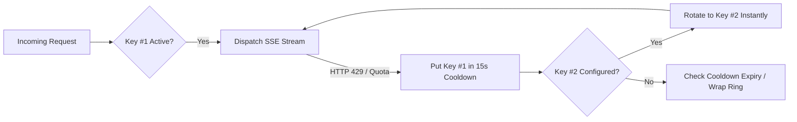

# 🤖 DeepCode AI Providers & Model Configuration Guide

DeepCode for Android delivers an expansive, multi-provider model routing system. From high-throughput free-tier endpoints and Google Cloud Code OAuth to specialized LPU inference and browser-backed session bridges, this guide covers authentication, endpoint routing, supported models, and token configuration.

---

## 📑 Table of Contents
- [1. Google Antigravity](#1-google-antigravity-google-cloud-code-oauth)
- [2. OpenCode Zen AI](#2-opencode-zen-ai-free--pro)
- [3. Ollama Cloud](#3-ollama-cloud-high-speed-cloud-infrastructure)
- [4. Headless ChatGPT Engine](#4-headless-chatgpt-engine-browser-bridge)
- [5. Google Gemini AI Studio](#5-google-gemini-ai-studio)
- [6. Groq Cloud LPU](#6-groq-cloud-lpu)
- [7. GMI Cloud](#7-gmi-cloud)
- [8. OpenAI API](#8-openai-api)
- [9. Anthropic Claude](#9-anthropic-claude)
- [10. OpenRouter & Aggregation Hubs](#10-openrouter--aggregation-hubs)
- [11. Multi-Key Ring Auto-Rotation (6 Slots)](#11-multi-key-ring-auto-rotation-6-slots)

---

## 1. 🌌 Google Antigravity (Google Cloud Code OAuth)

Google Antigravity routes through Google's internal Cloud Code infrastructure, offering access to Google's flagship **Gemini 3.5 & 3.1** reasoning models and Anthropic's **Claude 5** series.

### Access Type & Authentication
- **Access Type**: `Google OAuth 2.0 / Bearer (ya29.)`
- **Endpoint**: `https://daily-cloudcode-pa.googleapis.com`
- **Setup**: Sign in via **Settings → API Keys → Antigravity** or input an active OAuth bearer token starting with `ya29.`. Supports multi-key rotation across multiple token slots.

### Supported Models
| Model ID | Display Name | Context Window | Tier | Specialization |
|:---|:---|:---|:---|:---|
| `gemini-3-flash-agent` | **Gemini 3.5 Flash (High)** | 1,000,000 tokens | **Free** | Deep multi-step reasoning, agentic coding |
| `gemini-3.5-flash-medium` | **Gemini 3.5 Flash (Medium)** | 1,000,000 tokens | **Free** | Balanced reasoning and throughput |
| `gemini-3.5-flash-low` | **Gemini 3.5 Flash (Low)** | 1,000,000 tokens | **Free** | Ultra-low latency quick completions |
| `gemini-3-pro-preview` | **Gemini 3.1 Pro** | 1,000,000 tokens | Paid | Complex architectural design & refactoring |
| `gemini-3.1-pro-high` | **Gemini 3.1 Pro (High)** | 1,000,000 tokens | Paid | Extended thinking & verification |
| `gemini-3.1-pro-low` | **Gemini 3.1 Pro (Low)** | 1,000,000 tokens | Paid | Fast Pro tier responses |
| `gemini-3.1-flash-lite` | **Gemini 3.1 Flash Lite** | 1,000,000 tokens | **Free** | Lightweight conversational agent |
| `gemini-2.5-pro` | **Gemini 2.5 Pro** | 1,000,000 tokens | **Free** | Established enterprise reasoning |
| `gemini-2.5-flash` | **Gemini 2.5 Flash** | 1,000,000 tokens | **Free** | Everyday code editing and scripting |
| `gemini-2.5-flash-thinking` | **Gemini 2.5 Flash Thinking** | 1,000,000 tokens | **Free** | Visible chain-of-thought debugging |
| `gemini-2.5-flash-lite` | **Gemini 2.5 Flash Lite** | 1,000,000 tokens | **Free** | High-efficiency summarization |
| `gemini-2.0-flash-exp` | **Gemini 2.0 Flash (Exp)** | 1,000,000 tokens | **Free** | Experimental multimodality |
| `claude-sonnet-5` | **Claude Sonnet 5 (Thinking)** | 200,000 tokens | Paid | Hybrid reasoning & advanced syntax coding |
| `claude-opus-4-6-thinking` | **Claude Opus 4.6 (Thinking)** | 200,000 tokens | Paid | Complex logic deduction & research |
| `claude-sonnet-4-6` | **Claude Sonnet 4.6 (Thinking)** | 200,000 tokens | Paid | High-speed thinking model |
| `gpt-oss-120b-medium` | **GPT-OSS 120B (Medium)** | 128,000 tokens | Paid | Open-weight foundation model |

---

## 2. 🌟 OpenCode Zen AI (Free & Pro)

Zen AI is OpenCode's optimized inference network providing instant responses, low time-to-first-token (TTFT), and automatic model sanitization.

### Access Type & Authentication
- **Access Type**: `API Key / Bearer Auth`
- **Base URL**: `https://opencode.ai/zen/v1`
- **Client Header**: `X-OpenCode-Client: android/1.0.0`
- **Setup**: Enter your Zen API key in **Settings → API Keys → Zen AI**. Your key grants access to both Free and Pro/Paid models with up to 6 failover slots.

### Supported Free Models
| Model ID | Display Name | Context Window | Specialization |
|:---|:---|:---|:---|
| `deepseek-v4-flash-free` | **DeepSeek V4 Flash (Free)** | 1,000,000 tokens | Default flagship coder, rapid code generation |
| `mimo-v2.5-free` | **MiMo V2.5 (Free)** | 128,000 tokens | Compact, high-efficiency assistant |
| `nemotron-3.5-lightning-free` | **Nemotron 3.5 Lightning (Free)** | 128,000 tokens | Fast instruction-following & agent tools |
| `nemotron-3-ultra-free` | **Nemotron 3 Ultra (Free)** | 128,000 tokens | Deep context analysis |
| `muse-spark-1.2-contributor-free` | **Muse Spark 1.2 (Free)** | 128,000 tokens | Community contributor model |
| `ling-3.0-flash-fin-free` | **Ling 3.0 Flash Fin (Free)** | 128,000 tokens | Financial data & structured JSON logic |
| `laguna-s-2.1-free` | **Laguna S 2.1 (Free)** | 128,000 tokens | Fast conversational agent |

### Supported Pro & Paid Models
| Model ID | Display Name | Context Window | Tier |
|:---|:---|:---|:---|
| `claude-sonnet-5` | **Claude Sonnet 5** | 200,000 tokens | Paid |
| `claude-opus-5` | **Claude Opus 5** | 200,000 tokens | Paid |
| `claude-fable-5` | **Claude Fable 5** | 200,000 tokens | Paid |
| `claude-sonnet-4-6` | **Claude Sonnet 4.6** | 200,000 tokens | Paid |
| `gemini-3.7-flash` | **Gemini 3.7 Flash** | 1,000,000 tokens | Paid |
| `gemini-3.6-flash` | **Gemini 3.6 Flash** | 1,000,000 tokens | Paid |
| `gemini-3.5-flash` | **Gemini 3.5 Flash** | 1,000,000 tokens | Paid |
| `gpt-5.6-sol` | **GPT 5.6 Sol** | 128,000 tokens | Paid |
| `gpt-5.5` | **GPT 5.5** | 128,000 tokens | Paid |
| `gpt-5.4` | **GPT 5.4** | 128,000 tokens | Paid |
| `grok-4.6` | **Grok 4.6** | 128,000 tokens | Paid |
| `deepseek-v4-flash` | **DeepSeek V4 Flash (Pro)** | 1,000,000 tokens | Paid |
| `deepseek-v4-pro` | **DeepSeek V4 Pro** | 1,000,000 tokens | Paid |
| `glm-5.2` | **GLM 5.2** | 128,000 tokens | Paid |
| `minimax-m3` | **MiniMax M3** | 128,000 tokens | Paid |
| `kimi-k3` | **Kimi K3** | 128,000 tokens | Paid |
| `qwen3.6-plus` | **Qwen 3.6 Plus** | 128,000 tokens | Paid |

---

## 3. ☁️ Ollama Cloud (High-Speed Cloud Infrastructure)

> **Notice**: DeepCode has migrated from requiring a local workstation Ollama daemon to the official **Ollama Cloud** endpoint. You no longer need to configure port-forwarding or keep your desktop running.

### Access Type & Authentication
- **Access Type**: `API Key / Bearer Auth`
- **Base URL**: `https://ollama.com/v1`
- **Setup**: Add your key in **Settings → API Keys → Ollama Cloud**. If left blank, DeepCode connects using default credentials (`ollama`).

### Supported Cloud Models
| Model ID | Display Name | Context Window | Tier | Notes |
|:---|:---|:---|:---|:---|
| `qwen3-coder:480b` | **Qwen 3 Coder 480B** | 128,000 tokens | **Free** | Massive 480B parameter specialized coder |
| `gpt-oss:120b` | **GPT-OSS 120B** | 128,000 tokens | **Free** | Flagship open weights foundation model |
| `gpt-oss:20b` | **GPT-OSS 20B** | 128,000 tokens | **Free** | Fast lightweight execution |
| `gemma4` | **Gemma 4 31B** | 128,000 tokens | **Free** | Google open model optimized for agent tasks |
| `glm-4.7` | **GLM 4.7** | 128,000 tokens | **Free** | Multilingual instruction follower |
| `minimax-m3` | **MiniMax M3** | 1,000,000 tokens | **Free** | 1M token long-context processing |
| `minimax-m2.5` | **MiniMax M2.5** | 128,000 tokens | **Free** | High-speed logic model |
| `nemotron-3-super` | **Nemotron 3 Super 120B** | 128,000 tokens | **Free** | NVIDIA enterprise agent model |
| `nemotron-3-ultra` | **Nemotron 3 Ultra** | 128,000 tokens | **Free** | Extended reasoning model |

---

## 4. 🌐 Headless ChatGPT Engine (Browser Bridge)

New in **Release 1.1**, the Headless ChatGPT Bridge provides direct conversational inference with OpenAI's consumer web platform without paying API token costs.

### Access Type & Authentication
- **Access Type**: `Browser Session Bridge / Session Cookies`
- **Setup**: Open the **Connections** screen, tap **ChatGPT**, and sign in via the embedded browser.
- **Persistent State**: Executes within a dedicated single-session thread. Conversation history and code context persist across multiple tool turns.
- **Inline DALL-E 3**: Request images directly in chat; downloads render straight into your Android gallery.

---

## 5. 🌌 Google Gemini AI Studio

Direct connection to Google's official Gemini developer API.

### Access Type & Authentication
- **Access Type**: `API Key` (From [Google AI Studio](https://aistudio.google.com/))
- **Base URL**: `https://generativelanguage.googleapis.com/v1beta`
- **Setup**: Enter your Gemini key in **Settings → API Keys → Google Gemini**.

### Supported Models
| Model ID | Display Name | Context Window | Tier |
|:---|:---|:---|:---|
| `gemini-2.0-flash` | **Gemini 2.0 Flash** | 1,000,000 tokens | **Free Tier** |
| `gemini-2.0-flash-lite` | **Gemini 2.0 Flash Lite** | 1,000,000 tokens | **Free Tier** |
| `gemini-2.0-pro-exp-02-05` | **Gemini 2.0 Pro Experimental** | 2,000,000 tokens | **Free Tier** |
| `gemini-1.5-flash` | **Gemini 1.5 Flash** | 1,000,000 tokens | **Free Tier** |
| `gemini-1.5-pro` | **Gemini 1.5 Pro** | 2,000,000 tokens | Paid |
| `imagen-3.0-generate-002` | **Imagen 3 (Image Creation)** | 1024x1024 Image | **Free Tier** |
| `imagen-3.0-fast-generate-001` | **Imagen 3 Fast (Image Creation)** | 1024x1024 Image | **Free Tier** |

---

## 6. ⚡ Groq Cloud LPU

Powered by Groq's Language Processing Units (LPU) for lightning-fast token streaming.

### Access Type & Authentication
- **Access Type**: `API Key` (From [Groq Console](https://console.groq.com/))
- **Base URL**: `https://api.groq.com/openai/v1`
- **Setup**: Enter your token in **Settings → API Keys → Groq**.

### Supported Models
| Model ID | Display Name | Context Window | Tier | Notes |
|:---|:---|:---|:---|:---|
| `llama-3.3-70b-versatile` | **Llama 3.3 70B Versatile** | 128,000 tokens | **Free** | Default high-speed coder |
| `llama-3.1-8b-instant` | **Llama 3.1 8B Instant** | 128,000 tokens | **Free** | Ultra-low TTFT |
| `deepseek-r1-distill-llama-70b` | **DeepSeek R1 Distill 70B** | 128,000 tokens | **Free** | Open reasoning distillation |
| `openai/gpt-oss-120b` | **GPT OSS 120B** | 128,000 tokens | **Free** | High-capacity model |
| `openai/gpt-oss-20b` | **GPT OSS 20B** | 128,000 tokens | **Free** | Lightweight helper |
| `qwen/qwen3.6-27b` | **Qwen 3.6 27B** | 128,000 tokens | **Free** | Coding specialist |
| `groq/compound` | **Groq Compound (Agentic)** | 128,000 tokens | **Free** | Multi-step agent routing |
| `gemma2-9b-it` | **Gemma 2 9B** | 8,192 tokens | **Free** | Efficient compact model |

---

## 7. ☁️ GMI Cloud

High-throughput GPU inference cluster serving next-generation weights.

### Access Type & Authentication
- **Access Type**: `API Key` (From [GMI Cloud Console](https://console.gmicloud.ai))
- **Base URL**: `https://api.gmi-serving.com/v1`
- **Supported Models**: `Qwen/Qwen3.8-Flash`, `deepseek-ai/DeepSeek-V4-Flash`, `google/gemini-3.8-flash`, `moonshotai/kimi-k3`, `zai-org/GLM-5.3-Flash`, `openai/gpt-5.4`, `anthropic/claude-sonnet-4.6`, `MiniMaxAI/MiniMax-M3`, `nvidia/NVIDIA-Nemotron-3.5-Lightning-30B-A3B-BF16`.

---

## 8. 🧠 OpenAI API

Official OpenAI developer API endpoints.

- **Base URL**: `https://api.openai.com/v1`
- **Supported Models**: `gpt-4o`, `gpt-4o-mini`, `o1`, `o1-mini`, `o3-mini`, `gpt-4.5-preview`, `gpt-4-turbo`, `dall-e-3`, `dall-e-2`.

---

## 9. 🎭 Anthropic Claude

Official Anthropic developer API endpoints.

- **Base URL**: `https://api.anthropic.com/v1`
- **Supported Models**: `claude-3-7-sonnet-latest` (Hybrid Thinking), `claude-3-5-sonnet-latest`, `claude-3-5-haiku-latest`, `claude-3-opus-latest`, `claude-4.5-sonnet`, `claude-4.5-opus`, `claude-4.5-haiku`.

---

## 10. 🔗 OpenRouter & Aggregation Hubs

- **OpenRouter** (`https://openrouter.ai/api/v1`): Includes free models like `deepseek/deepseek-r1:free`, `deepseek/deepseek-chat:free`, `meta-llama/llama-3.3-70b-instruct:free`, `google/gemma-2-9b-it:free`, `qwen/qwen-2.5-72b-instruct:free`.
- **Cerebrus** (`https://api.cerebrus.com/v1`): Ultra-fast wafer-scale engines (`llama-3.3-70b`, `llama3.1-8b`, `qwen2.5-72b`, `gpt-oss-120b`).
- **Mistral AI** (`https://api.mistral.ai/v1`): `mistral-large-latest`, `codestral-latest`, `pixtral-12b-2409`.
- **Agent Router, Together AI, Perplexity, xAI, Cohere, DeepInfra, Fireworks, NVIDIA NIM, SambaNova, Hyperbolic, GitHub Models, Novita AI, SiliconFlow**.

---

## 11. 🔄 Multi-Key Ring Auto-Rotation (6 Slots)

DeepCode includes a native cryptographic key rotator (`ApiKeyRotator`) designed to eliminate API interruptions:

### Auto-Rotation Features:
1. **6 Slots Per Provider**: Store up to 6 distinct API keys for each configured provider in AES-256-GCM encrypted storage.
2. **Transparent Failover**: If any stream returns HTTP 429 (Rate Limit Exceeded) or quota exhaustion, DeepCode switches to the next available key slot immediately without breaking the active chat or user flow.
3. **Adaptive Cooldown**: Exhausted keys are isolated for a 15-second cooldown before rejoining the active rotation ring.
