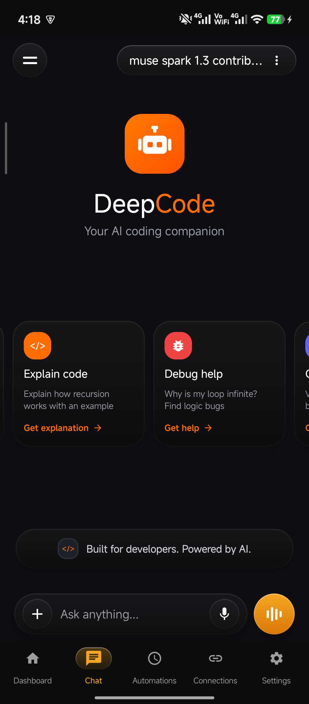
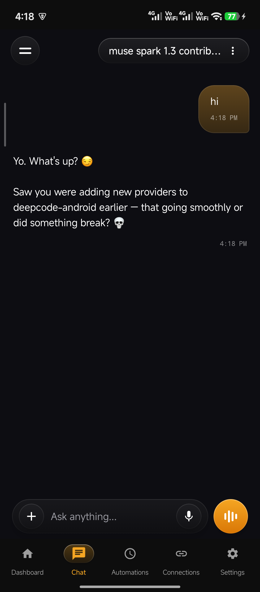
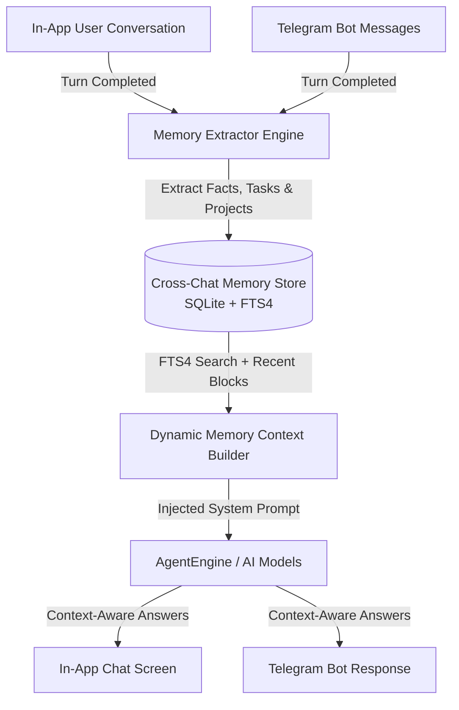
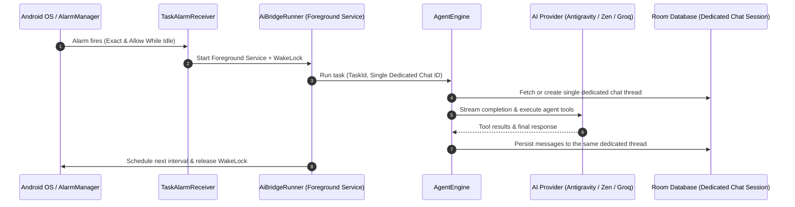

<div align="center">


# DeepCode

### Autonomous AI Agent, Code Engine & Automation Studio for Android

<a href="https://git.io/typing-svg">
  
</a>

<br/>

[](https://github.com/Deep007h/DeepCode/releases/tag/v1.3)
[-3DDC84?style=for-the-badge&logo=android&logoColor=white)](https://developer.android.com)
[](https://kotlinlang.org)
[](https://developer.android.com/jetpack/compose)
[](https://github.com/Deep007h/DeepCode)
[](LICENSE)

<p align="center">
  <a href="#-interface-preview"><b>Interface</b></a> •
  <a href="#-whats-new-in-v13"><b>What's New</b></a> •
  <a href="#-key-features"><b>Features</b></a> •
  <a href="#-cross-chat-long-term-memory"><b>Memory System</b></a> •
  <a href="#-ai-providers--model-matrix"><b>AI Providers</b></a> •
  <a href="#-agent-tools"><b>Tools</b></a> •
  <a href="#-background-automations"><b>Automations</b></a> •
  <a href="#-installation"><b>Installation</b></a>
</p>

</div>

---

## 📱 Interface Preview

<div align="center">

| 🚀 Welcome & Quick Actions | 💬 Live Streaming & Memory Recall |
|:---:|:---:|
|  |  |
| *Starter cards, quick prompts & neural voice entry* | *Real-time SSE streaming with Cross-Chat memory recall* |

<br/>

<p align="center">
  <sub><b>Left</b>: Fresh session with prompt starter cards, quick coding actions, and voice waveform mode. <b>Right</b>: Active autonomous agent conversation demonstrating continuous bi-directional Cross-Chat Long-Term Memory recall in real-time.</sub>
</p>

</div>

---

## 🚀 Overview

**DeepCode** transforms your Android smartphone or tablet into a full-fledged, autonomous AI development environment. By pairing flagship cloud models (**Google Antigravity**, **OpenCode Zen AI**, **Google Gemini**, **TokenHarbor AI**, **Groq LPU**, **Ollama Cloud**, **OpenAI**, **Anthropic**, **GMI Cloud**) with an integrated **Cross-Chat Long-Term Memory System**, **Telegram Bridge**, **Dual Terminal Shell**, **Sora Code Editor**, and **Automated PDF Studio**, DeepCode delivers desktop-grade agentic capabilities directly in the palm of your hand.

Whether you need to generate multi-file codebases, audit repositories, run multi-turn shell commands with root elevation, compile publication-grade PDFs, or schedule recurring autonomous background tasks that wake up your phone on exact intervals, DeepCode executes without compromise.

---

## ⚡ What's New in v1.3

<details open>
<summary><b>✨ Highlights of Release 1.3 (Current)</b></summary>
<br/>

- 🧠 **Cross-Chat Long-Term Memory System**:
  - **Bi-directional Memory Sync**: Seamlessly links **In-App Chat** and **Telegram Bot** conversations. Tasks, projects, preferences, and key technical instructions discussed via Telegram are instantly recalled during new in-app chat sessions and vice-versa.
  - **Zero-Latency Non-Blocking Extraction**: Background IO heuristics analyze turns post-completion without impacting streaming response rates, automatically filtering out greetings and trivial chit-chat.
  - **Hybrid SQLite FTS4 Fast Retrieval**: Combines top recent active memories across chats with query-matched prefix keyword search (`term*`) and fallback in-memory matching directly injected into prompt contexts.
  - **Dedicated Memory Settings Studio** (`Settings → Cross-Chat Memory`): Master switch, per-source toggles, real-time keyword search, filter chips (`All`, `In-App`, `Telegram`, `Manual`), topic badges, and full entry deletion/clearing.
- 🎨 **Fluid UI Motion & Animation Polish**:
  - **Smooth Spring-Interpolated Input Bar**: Upgraded chat input bar translation to `animateDpAsState` using `Spring.DampingRatioNoBouncy` and `Spring.StiffnessMedium`, eliminating jerky frame drops and bottom bar snapping during keyboard open/close.
  - **Synchronous Bottom Navigation Bar**: Removed delayed animation flags so the bottom navigation bar is uncovered synchronously and instantly with zero lag as the keyboard dismisses.
  - **Status Bar Alignment Fix**: Eliminated duplicate status bar padding on the Memory Settings screen, rendering headers neatly right beneath the system status bar.
- 🚀 **Animated Splash Screen & Launch Speed**:
  - Replaced the default blank launch screen with an animated splash screen featuring the glowing DeepCode logo, smooth pulsing scale transitions, and brand styling.
  - Resolved `IllegalArgumentException` on modern Android adaptive launcher icons with a safe software bitmap canvas fallback.
  - Reduced cold start latency and smoothed navigation transitions throughout the app.
- ⚡ **TokenHarbor AI Provider**:
  - Integrated **TokenHarbor AI** (`https://tokenharbor.ai/v1`) with free-tier model catalog (`deepseek-v4.1-flash:free`, `deepseek-v3:free`, `deepseek-r1:free`, `meta-llama-3.3-70b-instruct:free`, `gemini-2.5-flash:free`, `gpt-4o-mini:free`, and more).
  - Permanent model response time fix with streamlined prompt construction and optimized streaming latency.

</details>

<details>
<summary><b>📜 Highlights of Release 1.2</b></summary>
<br/>

- ⚡ **Multi-Provider & Multi-Key Ring Expansion**:
  - Full support for **70+ AI providers** (Nebius AI, AIML API, Scaleway, Lambda Labs, Friendli AI, MiniMax, Qwen, Baichuan, Yi, and more).
  - Storage ID normalization and multi-slot API key rotation (slots 1..6) with instant HTTP 429 / quota failover.
- 💬 **Instant Chat Responsiveness & Smooth Motion**:
  - Zero-latency optimistic in-memory message rendering before SQLite persistence.
  - Natural top-to-bottom scroll physics with precise `isNearBottom` viewport detection and jitter-free streaming follow (~7 fps).
- 🛡️ **Session Health & Error Isolation**:
  - Transient API connection drops and rate-limit errors are automatically filtered out of compacted conversation history to prevent poisoned context windows.
  - Comprehensive HTTP status code mapping (401 Unauthorized, 402 Credits/Quota, 429 Rate Limits, 403 Forbidden).
- 🎙️ **Microsoft Edge Neural Voice Synthesis**:
  - Dynamic client token generation and robust audio synthesis fallback for voice interactions.
- 📱 **Sora Editor & Dashboard Metrics Polish**:
  - Resolved asynchronous file loading race conditions in `EditorScreen.kt`.
  - Authoritative message sync counts and conditional reasoning chart slices.
- 🤖 **Telegram Bridge Upgrades**:
  - Proactive key validation before chat runs and dynamic model-to-provider inference across both static and OpenAI catalog models.

</details>

<details>
<summary><b>📜 Highlights of Release 1.1</b></summary>
<br/>

- 🌐 **ChatGPT Integration for Image and Docs Creation**: Connect your ChatGPT account in **Connections** for zero-API-cost inference, persistent single-session context preservation, high-precision document generation, and inline **DALL-E 3** image rendering.
- ⏰ **Rock-Solid Background Automations**:
  - Exact wakeups powered by Android's `AlarmManager.setExactAndAllowWhileIdle()` and `WAKE_LOCK`.
  - **Dedicated Persistent Threads**: Every scheduled automation task executes inside its own dedicated chat session—never creating duplicate chats on subsequent runs.
  - **Auto-Trigger on App Death**: Fully resilient to process kills and system reboots (`BOOT_COMPLETED`), maintaining scheduled execution reliably.
  - **Interactive Task Editor**: Modify schedules, prompt instructions, repetition intervals, and predefined workflows on the fly.
- 🌌 **Next-Gen Antigravity Provider**: Built-in support for Google's latest **Gemini 3.8 Flash**, **Gemini 3.8 Flash Cyber**, **Gemini 3.5 Flash** (High/Medium/Low), **Gemini 3.1 Pro** (High/Low), and **Claude Sonnet 5 / Opus 4.6**.
- 🌟 **Zen AI Muse Spark 1.3 & Gemini 3.8**: Added **Muse Spark 1.3 Free** (`muse-spark-1.3-contributor-free`, 1M context) alongside **Gemini 3.8 Flash**, **Claude Fable 5.1**, and **GPT-6 Astra**.
- ☁️ **Ollama Cloud Integration**: Transitioned from local daemon reliance to official high-throughput **Ollama Cloud** (`https://ollama.com/v1`) with Gemma 4 31B, GLM 4.7, GPT-OSS 120B, and Qwen 3 Coder 480B.

</details>

---

## 🌟 Key Features

```
  ┌────────────────────────────────────────────────────────────────────────┐
  │                           DEEPCODE ENGINE                              │
  ├──────────────────┬──────────────────┬──────────────────┬───────────────┤
  │   AI Providers   │  Cross-Chat Mem  │ Execution Shell  │  Automations  │
  ├──────────────────┼──────────────────┼──────────────────┼───────────────┤
  │ • Antigravity    │ • Unified Store  │ • Standard sh    │ • AlarmManager│
  │ • Zen AI (Muse)  │ • Telegram Sync  │ • Root su Shell  │ • Exact Wake  │
  │ • TokenHarbor AI │ • SQLite FTS4    │ • Background PIDs│ • Thread-Safe │
  │ • Groq LPU       │ • Auto-Extract   │ • Grep & Search  │ • Survives OS │
  │ • Ollama Cloud   │ • Topic Badging  │ • Sandbox Bypass │   Reboots     │
  └──────────────────┴──────────────────┴──────────────────┴───────────────┘
```

- 🤖 **Streaming Agentic Loop**: Multi-turn SSE streaming with dynamic tool-calling, chain-of-thought display, and syntax-highlighted code diffs.
- 🧠 **Cross-Chat Long-Term Memory**: Automatically captures and recalls project context, open pull requests, and preferences across In-App chats and Telegram bot conversations.
- 🔄 **Multi-Key Ring Auto-Rotation**: Store up to **6 API keys per provider** with silent, zero-delay failover when encountering HTTP 429 rate limits or quota caps.
- 💻 **Dual-Mode Terminal Console**: Full interactive terminal emulator supporting standard non-root shell and elevated root (`su` via libsu) execution.
- 📝 **Integrated Sora Editor**: Fast text and code editing engine with line numbers, undo/redo stacks, search-and-replace, and indentation control.
- 📄 **Native PDF Studio**: Generate beautiful, publication-ready PDF documents across 6 specialized presets (`classic`, `modern-minimal`, `corporate-report`, `academic-paper`, `invoice-receipt`, `resume-cv`).
- 🎙️ **Voice & Microsoft Edge TTS**: Speech-to-text input paired with edge-synthesized, neural voice audio responses.
- 🔒 **Hardware-Isolated Security**: All API keys, bearer tokens, and OAuth credentials encrypted via **AES-256-GCM** backed by the hardware **Android Keystore**.

---

## 🧠 Cross-Chat Long-Term Memory



### How Cross-Chat Memory Works:
1. **Continuous Passive Harvesting**: When you conclude a turn in In-App Chat or Telegram, a lightweight non-blocking background coroutine evaluates whether the exchange contains durable context (e.g. "I am testing new providers", "Working on PR #15", "Refactoring database migrations").
2. **Deterministic Noise Filtering**: Ephemeral banter, short single-word responses, and greetings are automatically pruned.
3. **SQLite FTS4 Retrieval**: When a query is entered, the app matches keywords using SQLite full-text search alongside recently indexed active memory chunks, merging them seamlessly into the agent's system prompt.
4. **Full Privacy Control**: Head over to **Settings → Cross-Chat Memory** to toggle memory sources on/off, inspect stored memories, search records, or delete specific items.

---

## 🧠 AI Providers & Model Matrix

DeepCode offers seamless routing across over 20 top-tier AI providers. Configure your keys in **Settings → API Keys**.

| Provider | Access Type | Highlighted Models | Context | Tier |
|:---|:---|:---|:---|:---|
| **Google Antigravity** | **Google OAuth 2.0 / Bearer (`ya29.`)** | `gemini-3.8-flash` (Gemini 3.8 Flash Workhorse)<br/>`gemini-3.8-flash-cyber`<br/>`gemini-3-flash-agent` (Gemini 3.5 Flash High)<br/>`gemini-3.5-flash-medium` / `gemini-3.5-flash-low`<br/>`gemini-3-pro-preview` (Gemini 3.1 Pro)<br/>`gemini-3.1-pro-high` / `gemini-3.1-pro-low`<br/>`gemini-3.1-flash-lite`<br/>`gemini-2.5-pro` / `gemini-2.5-flash`<br/>`claude-sonnet-5` (Thinking)<br/>`claude-opus-4-6-thinking`<br/>`gpt-oss-120b-medium` | 1M Tokens<br/>1M Tokens<br/>1M Tokens<br/>1M Tokens<br/>1M Tokens<br/>1M Tokens<br/>1M Tokens<br/>1M Tokens<br/>200k Tokens<br/>200k Tokens<br/>128k Tokens | **Free**<br/>Paid<br/>**Free**<br/>**Free**<br/>Paid<br/>Paid<br/>**Free**<br/>**Free**<br/>Paid<br/>Paid<br/>Paid |
| **OpenCode Zen AI** | **API Key / Bearer Auth**<br/>`https://opencode.ai/zen/v1` | `deepseek-v4-flash-free`<br/>`muse-spark-1.3-contributor-free` (Muse Spark 1.3)<br/>`muse-spark-1.2-contributor-free`<br/>`mimo-v2.5-free`<br/>`nemotron-3.5-lightning-free`<br/>`nemotron-3-ultra-free`<br/>`gemini-3.8-flash`<br/>`claude-fable-5.1`<br/>`claude-sonnet-5`<br/>`gpt-6-astra` / `gpt-5.6-sol`<br/>`deepseek-v4-pro` | 1M Tokens<br/>1M Tokens<br/>128k Tokens<br/>128k Tokens<br/>128k Tokens<br/>128k Tokens<br/>1M Tokens<br/>1M Tokens<br/>200k Tokens<br/>128k Tokens<br/>1M Tokens | **Free**<br/>**Free**<br/>**Free**<br/>**Free**<br/>**Free**<br/>**Free**<br/>Paid<br/>Paid<br/>Paid<br/>Paid<br/>Paid |
| **TokenHarbor AI** | **API Key / Bearer Auth**<br/>`https://tokenharbor.ai/v1` | `deepseek-v4.1-flash:free`<br/>`deepseek-v3:free`<br/>`deepseek-r1:free`<br/>`meta-llama-3.3-70b-instruct:free`<br/>`gemini-2.5-flash:free`<br/>`gpt-4o-mini:free`<br/>`mistral-small-3.1:free` | 128k Tokens<br/>128k Tokens<br/>128k Tokens<br/>128k Tokens<br/>1M Tokens<br/>128k Tokens<br/>128k Tokens | **Free**<br/>**Free**<br/>**Free**<br/>**Free**<br/>**Free**<br/>**Free**<br/>**Free** |
| **Ollama Cloud** | **API Key / Bearer Auth**<br/>`https://ollama.com/v1` | `qwen3-coder:480b`<br/>`gpt-oss:120b`<br/>`gemma4` (31B)<br/>`glm-4.7`<br/>`minimax-m3`<br/>`nemotron-3-super` (120B) | 128k Tokens<br/>128k Tokens<br/>128k Tokens<br/>128k Tokens<br/>1M Tokens<br/>128k Tokens | **Free**<br/>**Free**<br/>**Free**<br/>**Free**<br/>**Free**<br/>**Free** |
| **Google Gemini** | **Google AI Studio Key** | `gemini-3.8-flash` (Gemini 3.8 Flash)<br/>`gemini-2.0-flash`<br/>`gemini-2.0-flash-lite`<br/>`gemini-2.0-pro-exp-02-05`<br/>`gemini-1.5-pro`<br/>`imagen-3.0-generate-002` | 1M Tokens<br/>1M Tokens<br/>1M Tokens<br/>2M Tokens<br/>2M Tokens<br/>Image Gen | **Free**<br/>**Free**<br/>**Free**<br/>**Free**<br/>Paid<br/>**Free** |
| **Groq Cloud** | **Groq API Key (LPU)** | `llama-3.3-70b-versatile`<br/>`llama-3.1-8b-instant`<br/>`deepseek-r1-distill-llama-70b`<br/>`openai/gpt-oss-120b`<br/>`groq/compound` (Agentic) | 128k Tokens<br/>128k Tokens<br/>128k Tokens<br/>128k Tokens<br/>128k Tokens | **Free**<br/>**Free**<br/>**Free**<br/>**Free**<br/>**Free** |
| **ChatGPT Integration** | **Browser Session Bridge** | `chatgpt-web` (Persistent Session)<br/>`dall-e-3` (Image & Document Generation) | Dynamic<br/>1024x1024 | **Free**<br/>**Free** |
| **OpenAI API** | **OpenAI API Key** | `gpt-6-astra` (Flagship Sept 2026)<br/>`gpt-5.6-sol`<br/>`gpt-4o`<br/>`gpt-4o-mini`<br/>`o3-mini`<br/>`o1` / `dall-e-3` | 128k Tokens<br/>128k Tokens<br/>128k Tokens<br/>128k Tokens<br/>200k Tokens<br/>200k Tokens | Paid<br/>Paid<br/>Paid<br/>Paid<br/>Paid<br/>Paid |
| **Anthropic** | **Anthropic API Key** | `claude-fable-5.1` (Adaptive Thinking)<br/>`claude-opus-5`<br/>`claude-sonnet-5`<br/>`claude-3-7-sonnet-latest` (Hybrid)<br/>`claude-4.5-sonnet` / `claude-4.5-opus` | 1M Tokens<br/>200k Tokens<br/>200k Tokens<br/>200k Tokens<br/>200k Tokens | Paid<br/>Paid<br/>Paid<br/>Paid<br/>Paid |
| **GMI Cloud** | **GMI API Key** | `Qwen/Qwen3.8-Flash`<br/>`deepseek-ai/DeepSeek-V4-Flash`<br/>`google/gemini-3.8-flash`<br/>`moonshotai/kimi-k3`<br/>`zai-org/GLM-5.3-Flash` | 128k Tokens<br/>128k Tokens<br/>128k Tokens<br/>128k Tokens<br/>128k Tokens | Paid<br/>Paid<br/>Paid<br/>Paid<br/>Paid |
| **OpenRouter / Cerebras / Mistral** | **Respective API Keys** | Llama 3.3 70B, DeepSeek R1, Hermes 3 405B, Codestral, Mixtral 8x22B | Up to 128k | Free / Paid |

---

## 🛠️ Agent Tools

The autonomous agent loop is equipped with native tools executed in real-time on Android:

| Tool Signature | Purpose | Capability |
|:---|:---|:---|
| `create_pdf` | Document Generation | Compiles formatted PDFs using 6 clean design templates |
| `web_search` | Live Search | Queries live search engines and feeds markdown summaries back to LLM |
| `web_fetch` | Content Scraping | Fetches clean, stripped article text and documentation from any HTTP/HTTPS URL |
| `read_file` / `write_file` | File System I/O | Reads and writes files with atomic directory creation and UTF-8 handling |
| `list_directory` / `grep_search` | Codebase Exploration | Fast recursive tree traversal and regex-based multi-file pattern searching |
| `execute_command` | Shell Execution | Spawns background process in sandbox or `su` root with stdout/stderr capture |
| `edge_tts` | Speech Synthesis | Generates high-fidelity neural audio playback via WebSocket pipeline |
| `qr_generate` | QR Utility | Encodes texts, URLs, and payloads into high-resolution PNG QR images |
| `zip_create` / `zip_extract` | Archive Management | Bundles workspaces or extracts compressed archives seamlessly |
| `csv_to_json` / `csv_create` | Structured Data | Parses and transforms delimited tabular datasets on the fly |

---

## ⏰ Background Automations Engine

DeepCode includes an enterprise-grade automated execution engine designed for uninterrupted background operation:



### Key Automation Safeguards:
1. **Single Dedicated Chat Session**: Every task creates exactly one chat session on its initial run and persistently reuses that exact session for all future executions. Your conversation history stays organized and clean.
2. **Device Reboot & App Death Resilience**: Registered `BOOT_COMPLETED` receivers reschedule all active tasks instantly when your phone restarts. If the app is swiped from Recents, the `AlarmManager` wake alarm boots the background bridge automatically.
3. **Full In-App Task Editing**: Tap any automation in the **Automations** tab to edit prompt instructions, trigger times, repeating intervals, or delete obsolete tasks.

---

## 🔄 Multi-Key Ring Auto-Rotation

Never let a rate limit interrupt an autonomous coding session:
- **Up to 6 Keys Per Provider**: Store primary and fallback keys in hardware-backed encrypted storage.
- **Silent HTTP 429 Recovery**: If Key #1 encounters a rate limit or quota depletion, DeepCode automatically falls back to Key #2, Key #3, etc., within milliseconds.
- **Adaptive Cooldown Management**: Keys placed in cooldown automatically reactivate after 15 seconds, cycling smoothly through the key ring.

---

## 🏗️ Architecture & Tech Stack

```
DeepCode/
├── app/src/main/java/ai/deepcode/android/
│   ├── agent/             # AgentEngine, ToolExecutor, PluginEngine
│   ├── data/
│   │   ├── local/         # Room DB (ChatSession, Message, AutomationTask), MemoryStore
│   │   ├── remote/        # 20+ Providers, ZenModels, TokenHarbor, Antigravity
│   │   └── repository/    # AgentRepository, AutomationRepository, MemoryRepository
│   ├── service/
│   │   ├── automations/   # TaskAlarmReceiver, BootReceiver, TaskScheduler
│   │   ├── tools/         # Native implementations (Pdf, Web, Terminal, EdgeTTS)
│   │   └── AiBridgeRunner.kt # Foreground background execution runner
│   ├── ui/
│   │   ├── automations/   # AutomationsScreen, TaskEditSheet, ScheduleDialog
│   │   ├── chat/          # ChatScreen, ChatViewModel, AiBubble, SoraEditorView
│   │   ├── connections/   # ConnectionsScreen, ChatGPTBridge, TelegramBridge
│   │   ├── dashboard/     # DashboardScreen, Project Cards, Quick Stats
│   │   └── settings/      # MemorySettingsScreen, ApiKeysScreen, Themes, Logs
│   └── DeepCodeApp.kt     # Application lifecycle & dependency container
```

| Layer | Component | Details |
|:---|:---|:---|
| **Language** | Kotlin 2.0+ | Coroutines, StateFlow, Channels |
| **UI** | Jetpack Compose | Material Design 3, Dynamic Color, Edge-to-Edge |
| **Architecture** | MVVM + Clean Architecture | Repository pattern, decoupled service layer |
| **Database** | Room SQLite + FTS4 | Full-text memory search, encrypted migrations |
| **Networking** | OkHttp 4.12 + Retrofit | HTTP/2 connection pooling, SSE streaming |
| **Editor** | Sora Editor | Custom color schemes, line rendering |
| **Security** | Android Keystore | AES-256-GCM hardware-backed cryptography |
| **Root Engine** | libsu | TopJohnWu libsu for secure superuser shells |

---

## 📦 Installation

### Option 1: Direct APK (Recommended)
1. Download the latest **`DeepCode-v1.3.apk`** from [GitHub Releases](https://github.com/Deep007h/DeepCode/releases/tag/v1.3).
2. Allow installation from unknown sources in Android Settings.
3. Open DeepCode and configure your preferred provider in **Settings → API Keys**.

### Option 2: Build From Source
```bash
# 1. Clone repository
git clone https://github.com/Deep007h/DeepCode.git
cd DeepCode

# 2. Compile Debug APK with Gradle
./gradlew assembleDebug

# 3. Install on Android device via ADB
adb install -r app/build/outputs/apk/debug/app-debug.apk
```

---

## 🔐 Security & Privacy

- **On-Device Storage**: Code files, terminal history, memory chunks, and chat conversations remain strictly stored on your device.
- **Hardware Encryption**: Sensitive credentials are encrypted with AES-256-GCM keys managed by the Android Keystore.
- **Root Protection**: Root commands require explicit superuser elevation dialog approval through your device's root manager (Magisk / KernelSU / APatch).

---

## 📄 License

This project is licensed under the [MIT License](LICENSE).

<div align="center">
  <sub>Built with ❤️ for the global open-source developer & AI agent community.</sub>
</div>
